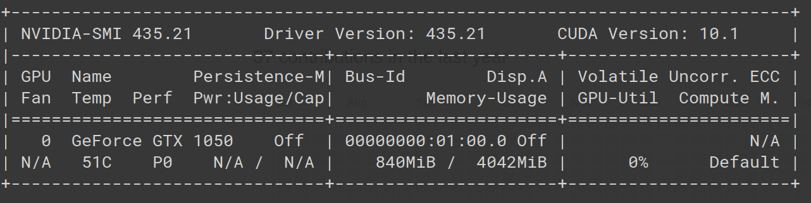

# A Transformer You Can Train From Home
"Training whole transformers is for big boys". Here, you can train a viable 12 layer transformer from home.  
Here's my laptops GPU stats with a little more than 3gb spare memory.   
<<<<<<< HEAD

And this is my laptop training a transformer. If this [4gb GPU](img/gpu2.png) computer [can train a transformer](img/pretrain2.png), so can yours.  
=======
  
And this is my laptop training a transformer. If this 4gb GPU laptop can train a transformer, so can your (modern non-Mac) computer.  
  
<<<<<<< Updated upstream
=======
>>>>>>> 4f3d5d061fa72e05554190682359f263326b5065
>>>>>>> Stashed changes
Obviously a transformer, as large as it is, is typically only __one__ component of a larger specific model. You would need to do further work for whatever downstream tasks you intend on applying this to. 

### Installation
Create an environment, perhaps with Conda:  
`conda create --name trainfromhome`  
`conda activate trainfromhome`  
 
Install with pip:  
`pip install -r requirements`    

### Usage
To train the transformer:  
`python pretrain.py`  

To download and finetune on downstream GLUE tasks:  
`python -m src.downstream.download_glue_data --data_dir data --tasks all`  
`python -m src.downstream.glue`

[Is it working?](img/Discriminator_Generator_Loss.png)  
`pip install -U protobuf tensorflow`
`pip install tensorboardX`
`tensorboard --logdir logs`

### How does it work?
Essentially, we have a hybrid model of ALBERT and ELECTRA. 
1. Factorized word embeddings: represent words in a more parameter efficient way.
2. Shared Cross-Layer Parameters: Reuse transformer blocks.
3. Sentence-Order Prediction (SOP) training tasks: A better variant of Next Sentence Prediction (NSP)
4. N-Gram MLM: From XLNET and SpanBERT
5. Replaced Token Detection: A GAN-like training task of transformer networks, which we see in ELECTRA.

### Future implementations
1. Further develop geenerator model for generative tasks, ie Beam Search.
2. Implement an equivalent of SpanBERT

### References
Lan, Zhenzhong, et al. "Albert: A lite bert for self-supervised learning of language representations." arXiv preprint arXiv:1909.11942 (2019).  

Clark, Kevin, et al. "Electra: Pre-training text encoders as discriminators rather than generators." arXiv preprint arXiv:2003.10555 (2020).  
 
 Joshi, Mandar, et al. "Spanbert: Improving pre-training by representing and predicting spans." Transactions of the Association for Computational Linguistics 8 (2020): 64-77.

[Great PyTorch Implementation of ALBERT](https://github.com/graykode/ALBERT-Pytorch)

